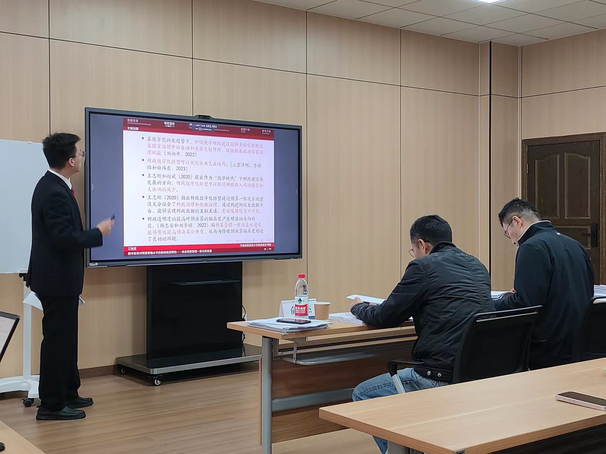

This presentation occurred on the Project Interim Defense meeting of 2024 National College Students Innovation and Entrepreneurship Training Program which I host. I reviewed the topic we research on and showcased the progress of our project. We had collected the part of data from more than 300 cities in the early stages. You can find our project detailed information in my CV or homepage.  

Through this mid-term inspection, our project has obtained a **national level** rating, which is the highest level. (In fact, the rating includes three levels: national level, provincial level, and school level)  
Here is the slides I used for Interim Defense:  [Interim Defense](../slides/中期答辩.pdf)
