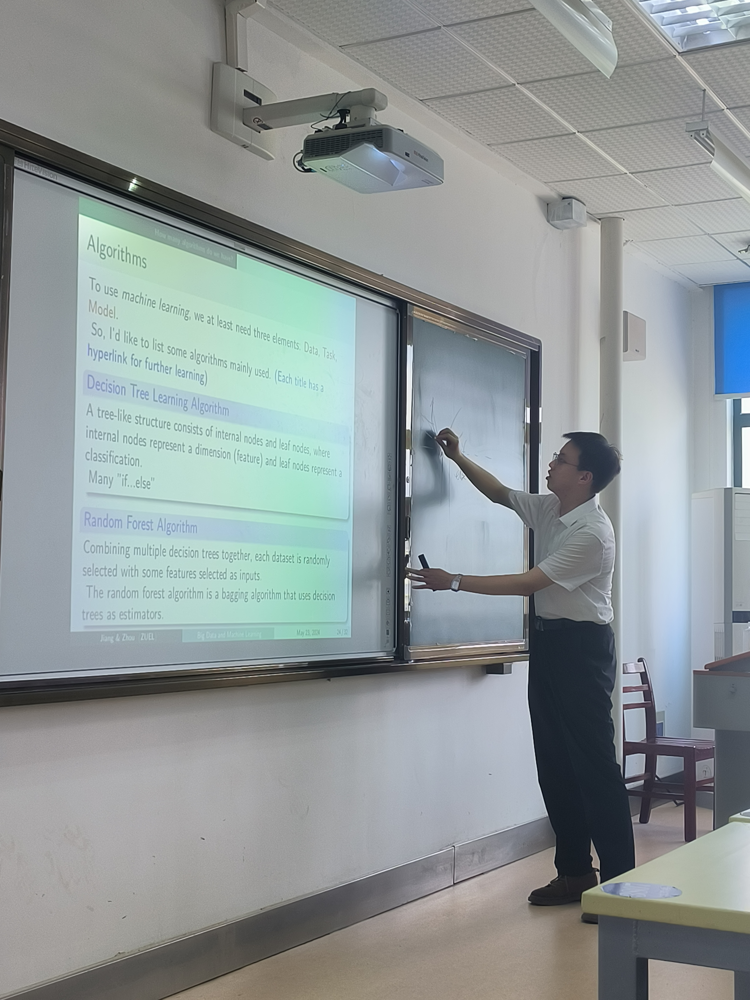

This lecture is about the basic introduction of big data and machine learning. The lecture took place at 11th Zhongyuan econometic training camp for the elite students in our school. The detailed camp information you can find in my CV and this is an offical link about [the camp opening ceremony](https://csxy.zuel.edu.cn/2024/0401/c7104a360067/page.htm#).   
On this lecture, we integrated and restated the relevant concepts and principles about the topic. It consisted five parts which are： 
1. What is Big Data? 
2. What is Machine Learning? 
3. How many algorithms do we have? 
4. Machine Learning & Econometrics 
5. An Application in R: 10-Fold Cross-Validation  

 

You can find my [slides](../slides/Big Data and Machine Learning  Jiang & Zhou 0523.pdf) here.

