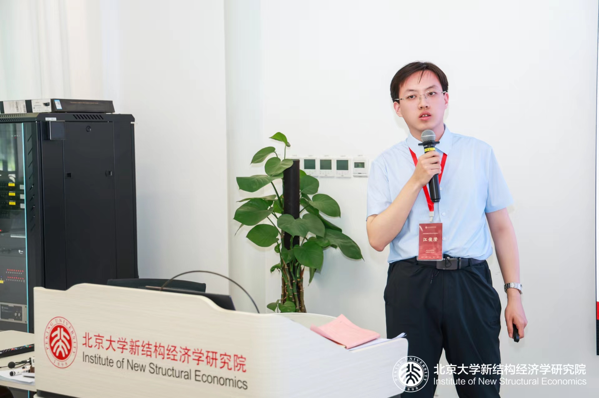
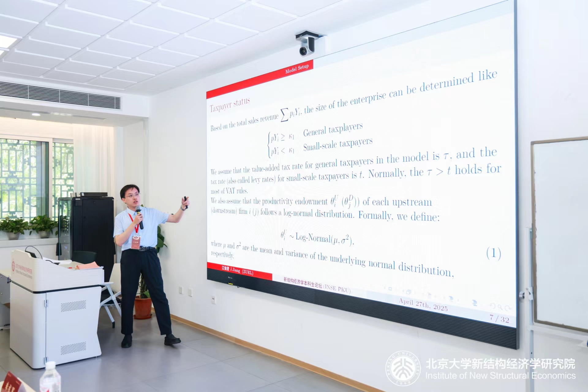
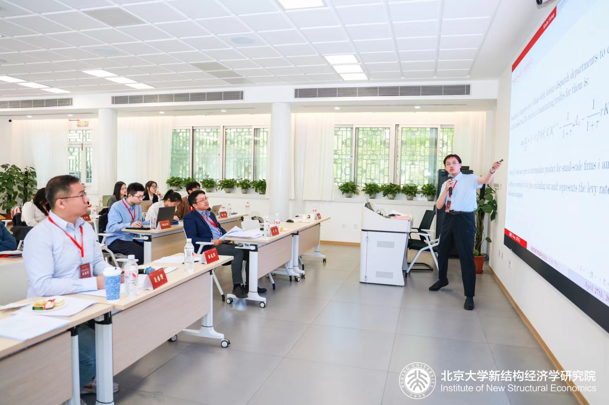

On April 27, 2025, the first Undergraduate Forum on New Structural Economics was successfully held at the Langrun Garden of Peking University.  

During this conference, I presented a working paper titled *Taxpayer Status and Monopoly Markup in Vertical Industrial Structure* at Sub-forum II "Industrial Policy and Technological Innovation".   
 
 
 
Thanks to Yong Wang(PKU), Chunzan Wu(PKU) for helpful comments and discussions.

Here is the [slides](../slides/How To Read The Economics Papers__JIANG.pdf) I reported, which is the preliminary results of the working paper.

