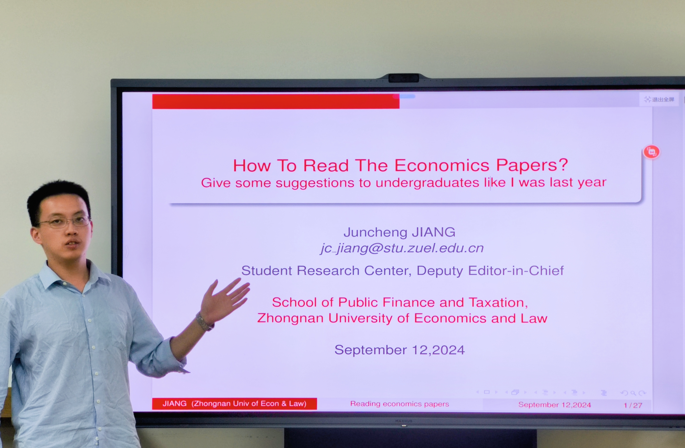

This lecture is about the basic introduction of __how to read the ecomomics papers__. The audience is mainly sophomore undergraduate students.  
 
In this lecture, I first explained the necessity of reading literature for every undergraduate student and some common sense that need to be known before reading. 
Then, I systematically explained the classification of article types in economic literature. Also, I pointed out the parts in an article which should pay more attention to for both theoretical and empirical papers .   
Next, I introduced the methods of intensive reading and extensive reading, as well as their requirements for taking reading notes.  
Finally, I took an article about __Tax Salience__ __(Chetty et al., 2009)__ published on ___the American Economic Review___  as an example to show  how to read and taked intensive reading notes

You can find my [slides](../slides/How To Read The Economics Papers__JIANG.pdf) here.
